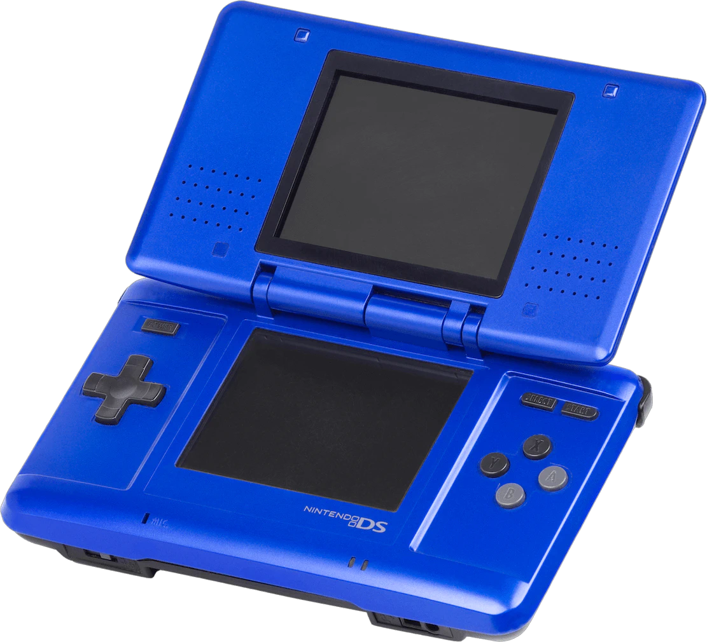
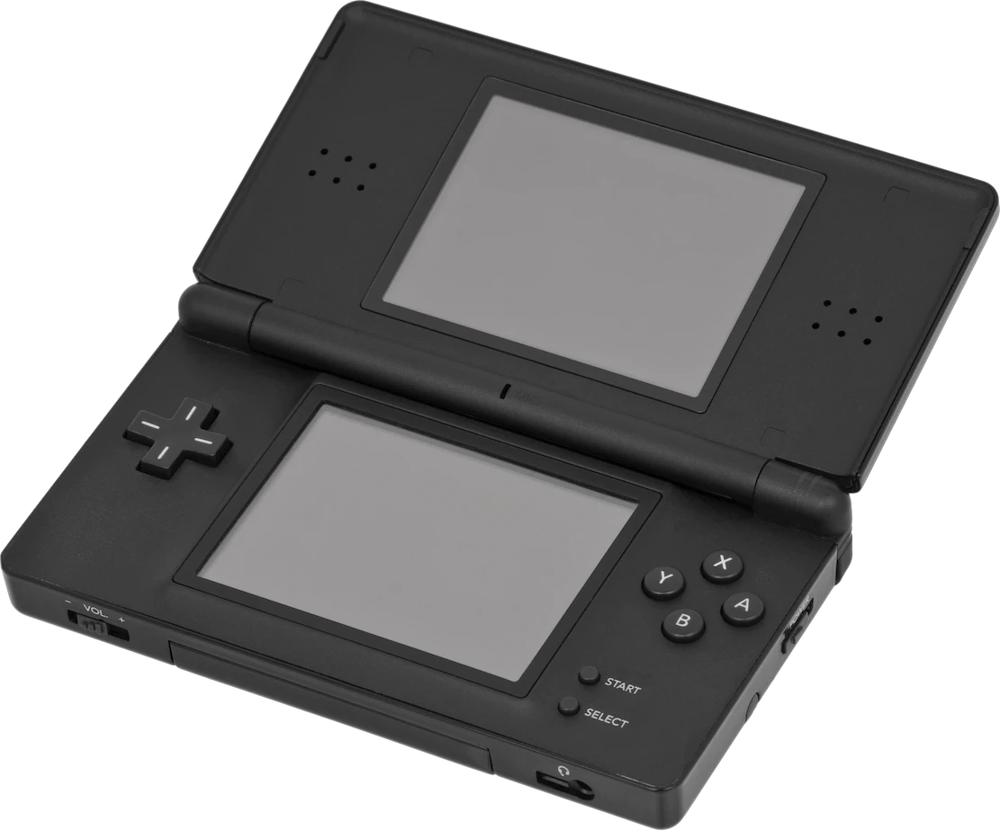
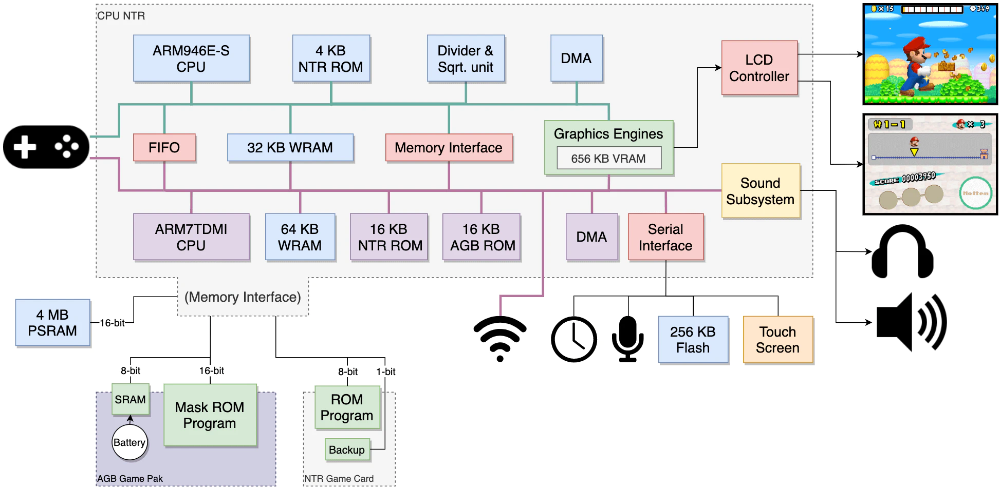
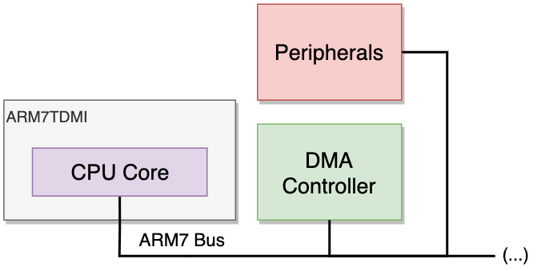
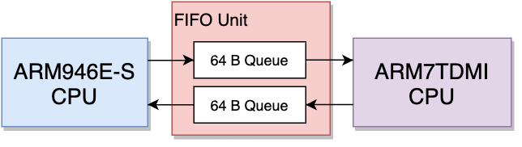

# Nintendo DS Architecture

[Nintendo DS Architecture](https://www.copetti.org/writings/consoles/nintendo-ds/)を翻訳したもの

## Model

## Diagram

## CPU

任天堂のこれまでの携帯型ゲーム機と同様、DSは"CPU NTR"と名付けられた大きなチップを中心に動いています。

NTRとは、初代ニンテンドーDSのコードネームである「Nitro」の略語です。

CPU NTRは、2つの異なるARM CPUを使った興味深いマルチプロセッサアーキテクチャを実装していますが、この設計はARMホールディングスがマルチプロセッサソリューションを正式に発表する前に行われました。

そのため、現在のマルチプロセッサ技術を考慮すると、その機能は少し異例と言えるかもしれません。

このシリーズで分析した並列システムはこれが初めてではありませんが、その設計は他のものとは大きく異なります。

例えば、セガサターンのような実験的なマスタースレーブ構成でも、PS1やN64のようなコプロセッサ方式でもありません。

ニンテンドーDSには、排他的な動作を行う2つの独立したコンピュータが搭載されており、それぞれが専用のバスを持っています。

この共依存関係が、このゲーム機の全体的なパフォーマンスを左右しています。

それでは、2つのCPUについて見ていきましょう。

**ARM7TDMI**

ARM7TDMIは、ゲームボーイアドバンスに搭載されていたCPUと同じですが、DSではGBAのときの2倍の約34MHzで動作しています。

また、THUMBモードを含めて、オリジナルの機能もすべて搭載されています。

任天堂のエンジニアは、DS開発時に、ARM7をほとんどのI/Oポートの隣に配置したため、このCPUはI/O操作の仲裁や補助を行うことになります。

実際、他のプロセッサはI/Oに直接接続することはできません。このように、これはシステムを担当する「メイン」プロセッサではなく、多くの部品にデータを渡すことでメインCPUの負荷を軽減する「サブ」プロセッサなのです。

**ARM946E-S**

これがニンテンドーDSのメインCPUで、約67MHzで動作しています。

不遇の時代を過ごしたARM8シリーズを除けば、ARM946E-SはARM7の次世代バージョンと言えるでしょう。 

ARM9シリーズの中でも特にこのコアは、ARM7TDMIの機能をすべて継承しているだけでなく、いくつかの追加機能も備えています。

- ARMv5TE命令セット: ARMv4の命令セットと比較して、命令が増え、乗算がより高速に行えるようになりました。
- 5段のパイプライン: GBAの3段階のパイプラインからさらに進化しました。
- 12KBのL1キャッシュ: このプロセッサにはキャッシュが搭載されており、命令用に8KB、データ用に4KBが割り当てられています。
- 48KBのTCM: 命令(32KB) + データ(16KB)の高速なキャッシュメモリです。

また、任天堂はその周りに次のような部品を加えています。

- 除算ユニットと平方根ユニット: ARM9には本来定義されていないものです。
- DMAコントローラ: CPUに頼らずにメモリの転送を高速化します。またキャッシュの使用と合わせて、CPUとDMAの両方が同時に動作することも可能です。(キャッシュやDMAは、多くのパフォーマンスを提供する一方で、データの整合性などの新たな問題を引き起こします。例えば、DMAを実行する前に書き込み用のバッファをフラッシュするなど、プログラマが手動でメモリの整合性を保つ必要があります。)

**プロセッサの関係性**

ここまでは、2つのCPUがそれぞれどのように動作するかを説明してきました。

しかし、全体として機能するためには、常に協力し合うことが必要です。

これを実現するために、2つのCPUは専用のFIFOユニットを使って直接通信します。このデータブロックには、2つの64バイトのキュー（最大16要素）が格納されており、双方向の通信が可能です。

これは次のような仕組みです。（相手にメッセージを送る必要がある）送信側のCPUは32bitのデータブロックをキューに入れ、受信側のCPUはそのブロックをキューから取り出して必要な処理を行います。

キューに値が書き込まれると、どちらかのCPUがポーリングにより手動で値を取得することができますが、この場合、常に新しい値が書き込まれたかどうかをチェックする必要があるためコストがかかります。

また、ポーリング以外にも、キューに新しい値が書き込まれたときに、割り込みユニットを起動して受信側に通知することもできます。

