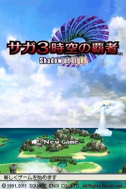
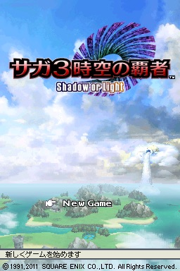

# フォグ

フォグとは、深度値に比例して各ピクセルの色をフォグ色と合成する処理です。この処理により画面上に霧効果を生成でき、自然界では発生しない遠方平面クリッピング処理をプレイヤーから隠蔽します。

  
使用例

左: フォグOFF, 右: フォグON

&nbsp;&nbsp;

フォグ機能は`DISP3DCNT.7`でON/OFFの切り替えが可能です。

OpenGLではフォグは各ポリゴンが描画される際に実行されますが、NDSでは、エッジ抽出後に全てのポリゴンが描画されたカラーバッファに対してフォグ処理が実行されます。(いわゆるポストプロセス) この仕様により、指定領域を除く全てにフォグを適用する効果を生成できます。ただし、半透明ポリゴンがレンダリングされる領域にフォグを適用すると不自然な効果が生じる場合があります。この場合は`POLYGON_ATTR.11`をセットしてください。

If you update the depth value, you must also conduct a Z sort, or else some parts inside regions in which translucent polygons overlap may not be rendered.

TODO
