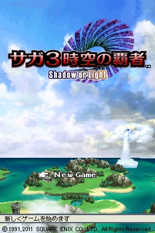
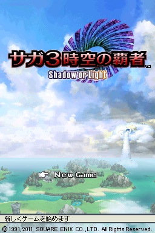

# フォグ

フォグとは、深度値に比例して各ピクセルの色をフォグ色と合成する処理です。この処理により画面上に霧効果を生成でき、自然界では発生しない遠方平面クリッピング処理をプレイヤーから隠蔽します。

<details>
  <summary>使用例</summary>

左: フォグOFF, 右: フォグON

&nbsp;&nbsp;

</details>

フォグ機能は`DISP3DCNT.7`でON/OFFの切り替えが可能です。

OpenGLではフォグは各ポリゴンが描画される際に実行されますが、NDSでは、エッジ抽出後に全てのポリゴンが描画されたカラーバッファに対してフォグ処理が実行されます。この仕様により、指定領域を除く全てにフォグを適用する効果を生成できます。ただし、半透明ポリゴンがレンダリングされる領域にフォグを適用すると不自然な効果が生じる場合があります。この場合は`POLYGON_ATTR.11`をセットしてください。

> [!NOTE]
> (`POLYGON_ATTR.11`をセットすることで)深度値を更新する場合は、Zソートも実施する必要があります。そうしないと半透明ポリゴンが重なる領域内の特定部分がレンダリングされない可能性があります。

## 4000358h - FOG_COLOR - フォグ色 (W)

2D画面の背景と合成する場合、フォグのα値を0に設定すると、3Dオブジェクトが2D画面に溶け込むエフェクトを得られます。この効果は、`DISP3DCNT.6`をセットするとより自然に見えます。

```
  Bit    Expl.
  0-14   フォグ色 (RGB555)
  15     不使用
  16-20  フォグのα値         ;-used no matter of DISP3DCNT.Bit6
  21-31  不使用
```

## 400035Ch - FOG_OFFSET - Fog Depth Offset (W)

```
  Bit    Expl.
  0-14   Fog Offset (Unsigned) (0..7FFFh)
  15-31  不使用
```

フォグ密度の計算の基礎となる深度値を設定します。

上位15ビットの深度値が `(FOG_OFFSET + (0x400 >> FOG_SHIFT))` より近いピクセルのフォグ密度は、フォグ密度テーブルの DENSITY0 値に固定されます。

Sets the depth value that is the basis for fog density calculations.

The fog density for pixels that have an upper 15-bit depth value nearer than `(FOG_OFFSET + (0x400 >> FOG_SHIFT)) ` is fixed to the fog density table's DENSITY0 value. The fog density for pixels that have a depth value farther than `(FOG_OFFSET + (0x400 >> FOG_SHIFT) * 32)` is fixed to DENSITY31.

## 4000360h..37Fh - FOG_TABLE - フォグ密度テーブル (W)

```
  Bit  Expl.
  0-6  フォグ密度 (0..127)
```

各ピクセルのフォグ密度は、対応する深度バッファ値の線形補間によって得られる値となります。

